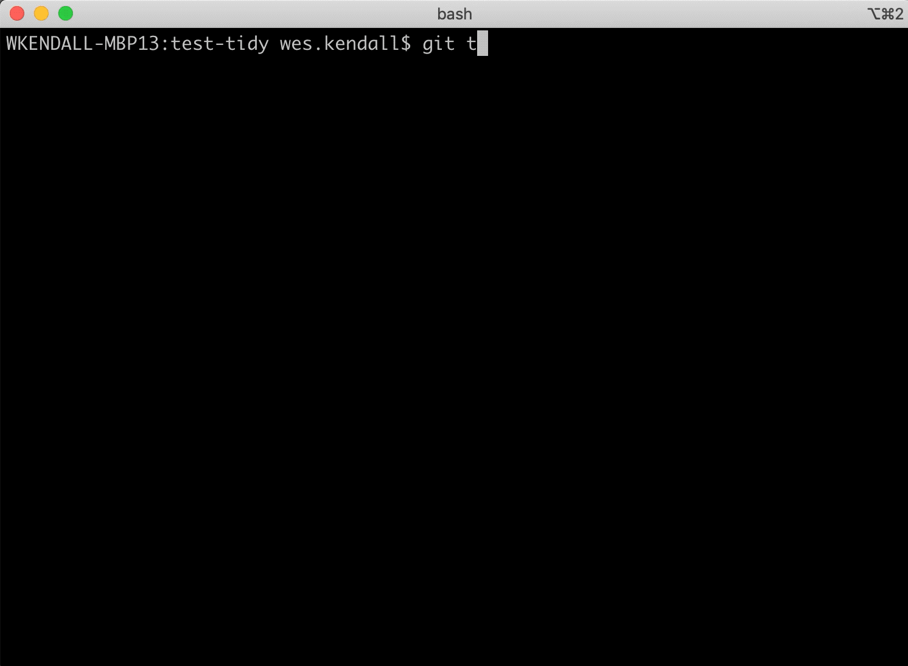

git-tidy
########

``git-tidy`` is a set of git extensions for:

1. Keeping your git logs tidy with ease. ``git tidy-commit`` guides
   users through a structured commit with a configurable schema.
   ``git tidy-squash`` squashes messy commits into one tidy commit.
2. Linting a commit log. ``git tidy-lint`` verifies that commits
   match the schema. If a user uses ``git tidy-commit``, commits
   will *always* validate.
3. Rendering a commit log. ``git tidy-log`` can render commits from
   any range and can render structured commits from a configurable
   `Jinja <https://jinja.palletsprojects.com/en/2.11.x/>`__ template.
   Want to automatically generate release notes? ``git tidy-log`` can
   be configured to group and render commits based on the schema.

Documentation
=============

`View the git-tidy docs here
<https://git-tidy.readthedocs.io/>`_ for a complete tutorial on using
``git-tidy``.

Installation
============

``git-tidy`` can be installed a number of ways. The preferred way
on OSX is with `homebrew <brew.sh>`__ ::

    brew tap jyveapp/homebrew-tap
    brew install git-tidy

If not on OSX, one can install ``git-tidy`` system-wide with
`pipx <https://github.com/pipxproject/pipx>`__::

    pipx install git-tidy

``git-tidy`` can also be installed with pip. Be sure to install it system-wide
so that ``git-tidy``'s execution is not tied to a virtual environment::

    pip3 install git-tidy

.. note::

  ``git-tidy`` depends on git at a version of 2.22 or higher. OSX
  users can upgrade to the latest ``git`` version with
  `homebrew <brew.sh>`__ using ``brew install git``.

Contributing Guide
==================

For information on setting up git-tidy for development and
contributing changes, view `CONTRIBUTING.rst <CONTRIBUTING.rst>`_.

Primary Authors
===============

- @wesleykendall (Wes Kendall)
- @tomage (Tómas Árni Jónasson)
