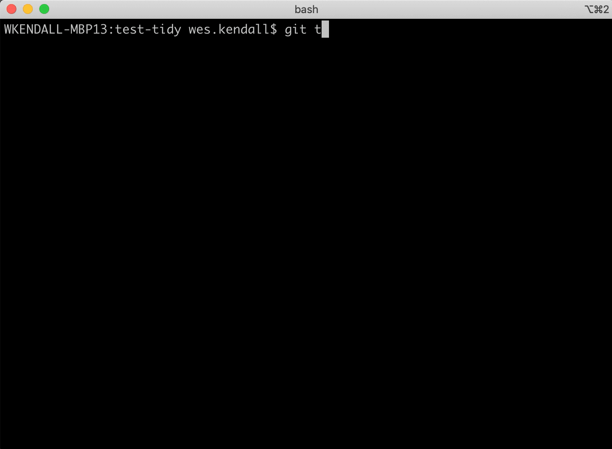

# git-tidy

`git-tidy` is a set of git extensions for:

1. Keeping your git logs tidy with ease. `git tidy-commit` guides users through a structured commit with a configurable schema. `git tidy-squash` squashes messy commits into one tidy commit.
2. Linting a commit log. `git tidy-lint` verifies that commits match the schema. If a user uses `git tidy-commit`, commits will *always* validate.
3. Rendering a commit log. `git tidy-log` can render commits from any range and can render structured commits from a configurable [Jinja](https://jinja.palletsprojects.com/en/2.11.x/) template. Want to automatically generate release notes? `git tidy-log` can be configured to group and render commits based on the schema.

See the [Tutorial](tutorial.md) for a walk-through of how to use `git-tidy` for your use case.

## Compatibility

`git-tidy` is compatible with Python 3.9 - 3.13.
