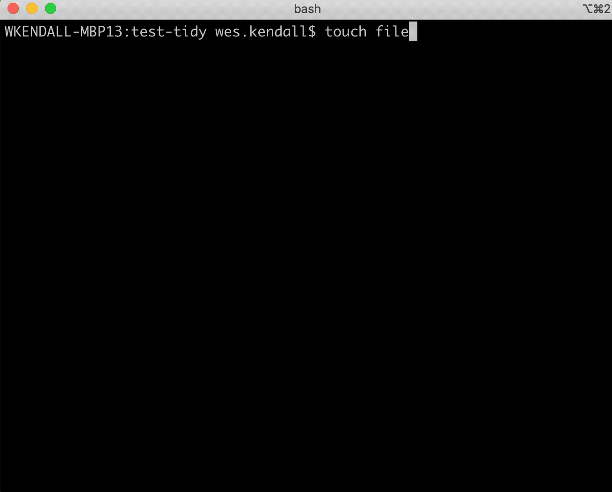

# Tutorial

## Terminology

There are a few pieces of terminology to define before getting started:

1. `tidy schema` - The tidy schema is a user-defined specification of which attributes should be collected during a commit. The default schema only specifies a summary and optional description for each commit. Users can override this with the `.git-tidy/commit.yaml` file. We will go into some schema examples later.
2. `tidy template` - The Jinja template that is used to render commits with `git tidy-log`. The template is passed the parsed commits, which can be grouped and filtered among all commit attributes (and attributes from the schema). The default template groups commits by tag and renders summaries and descriptions. Users can override this with the `.git-tidy/log.tpl` file.

These are the primary pieces of configuration needed in order to utilize `git-tidy` to its fullest extent. We first start by showing an example schema and associated commits.

## An Example Schema and Commit

In this quick start, we want to ensure that our commit messages all have the following information:

1. A summary about the commit.
2. An optional description.
3. A required type. We want to prompt the user to categorize the type of the commit message with the following choices - bug, feature, or trivial.

By default, `git-tidy` will always prompt for the summary and description. Although this can be overridden, we only need to specify our additional "type" attribute in our schema. Our tidy schema looks like this:

```yaml
- label: type
  help: The type of change.
  choices:
    - bug
    - feature
    - trivial
```

In the above, our schema has a "type" attribute that will be collected. When we prompt the user for the type, the user will see the help text and will only be able to enter one of the three choices.

The [formaldict library](https://github.com/Opus10/formaldict) that parses the schema is directly integrated with [python-prompt-toolkit](https://github.com/prompt-toolkit/python-prompt-toolkit, meaning any information entered gathered by the prompt will validate the schema (and our tidy linting we will do later!).

Here's what a tidy commit looks like with our schema:


The commit message is stored like this in git:

```bash
> git show --summary
commit a6d7dd765746ccddc0eec162f4f422efee0cd5ea (HEAD -> master)
Author: John Doe <john.doe@example.com>
Date:   Mon Jan 6 16:13:31 2020 -0600

    This is the first commit!

    This wonderful commit has a great README.

    The README has lots of information about the project.

    Type: feature
```

## Linting Commits

`git-tidy` comes with a linter, allowing verification that commits adhere to the tidy schema. When running the linter, one must supply a range of commits to validate. Normally this is done against the branch over which a pull request will be submitted. For example, `git tidy-lint origin/develop..` will lint all of the commits on your branch since `origin/develop`.

`git-tidy` comes built in with Github support. In order to lint against all of the commits against the base branch of an open pull request, run `git tidy-lint :github/pr`. The special ":github/pr" range tells `git-tidy` to look up the base branch of the open pull request.

Sometimes it may be beneficial to ensure that at least one commit is a tidy commit for every pull request. In this case, one can run the linter with the `--any` flag (`git tidy-lint :github/pr --any`), which verifies that at least one commit passes validation.

Below is an example of committing another bad commit to our example from before. Linting is executed in both modes.


## Rendering Commits

Commits can be rendered into a Changelog specified by a user-supplied Jinja template. The template is supplied with the following variables:

1. `output` - The output file, if any, supplied to `git tidy-log`.
2. `range` - The range of commits (if any) being logged.
3. `commits` - The [tidy.CommitRange][] object retrieved during the `git log` call. The [tidy.CommitRange][] object has methods for grouping and filtering commit messages.

Similar to linting, `git tidy-log` takes a range of commits as an argument. For example, to render a log with everything after tag `v1`, do `git tidy-log v1..`.

Here's an example of a [Jinja](https://jinja.palletsprojects.com/en/2.10.x/api/) template to render our example schema. This template is stored under our repo in `.git-tidy/log.tpl`:

```jinja

# {{ tag|default('Unreleased', True) }} ({{ tag.date.date() }})


## {{ type|default('Other', True)|title }}


  - {{ commit.sha }}: Commit could not be parsed.

  - {{ commit.summary }} [{{ commit.author_name }}, {{ commit.sha }}]


    {{ commit.description|indent(4) }}






```

In the above template, we are grouping our commits by tag first and by type second. Here's what it looks like with our two example commits from before.


!!! note

    One of the commits from our example didn't pass validation, so it didn't have a "type" for grouping. When this happens, it gets passed to the `None` group, and the template can make a special case when rendering it.


Each commit (in the `commits` object or the groupings) is a [tidy.Commit][] object that contains all of the user-supplied attributes in the schema and the following attributes:

1. `sha` - Full SHA of the commit.
2. `author_name` - The author name of the commit.
3. `author_email` - The author email of the commit.
4. `author_date` - The time at which the commit was authored.
5. `committer_name` - The name of the person who performed the commit.
6. `committer_email`- The email of the person who performed the commit.
7. `committer_date` - The time at which the commit was performed.
8. `tag` - The tag, if any, that contains the commit.
9. `msg` - The raw commit message.
10. `is_valid` - `True` if the commit passed validation, `False` otherwise. If `False`, some of the user-supplied attributes may not be available.
11. `is_parsed` - `False` if an unexpected error happened when parsing the commit message. If `False`, only the `msg` and `sha` are available.
12. `validation_errors` - The validation errors, if any, that happened.

Note that all of these attributes, along with any defined in the commit schema, may be used for grouping and filtering `tidy.CommitRange` objects.

If one wishes to have separate templates for separate types of renderings (e.g. a verbose change log vs a summary), use the `--style` option. The `--style` option will use a template under the path of `.git-tidy/log_{{ style }}.tpl`.

!!! note

    `git tidy-log` has the ability to redirect the log to a file with the `-o` option. One can also use `git tidy-log :github/pr -o :github/pr` to generate a log based on a Github pull request and also send the output as a Github pull request comment. This can be used for integrating log previews into your continuous integration and pull request review process.

## Squashing Commits

Oftentimes an engineer will open up a pull request, address reviewer comments in commits, and then squash all commits into one before merging. The same holds true for doing miscellaneous fixups before opening a pull request.

In order to facilitate the flow of engineers still being able to use the standard `git commit` for development, `git-tidy` allows squashing all commits into a single tidy commit.

Let's continue with our previous example and assume that we do a few standard commits in a row followed by a tidy squash for all of them. Here's an example of what this looks like:



In the above, two standard commits are created and squashed into one tidy commit.

`tidy-squash` takes a reference point (e.g. `origin/develop`, `HEAD~1`). All commits since the common ancestor of the reference point will be squashed. Similar to other `git-tidy` commands, the special `:github/pr` value can be used as a reference point for all commits in an open pull request.

!!! note

    `git-tidy-squash` will use the input of the first valid tidy commit as input to the squashed commit if any valid commits are found.

## More Examples

For more examples of schema specifications, check out the [formaldict Docs](https://formaldict.readthedocs.org). Check the docs for `tidy.CommitRange` for all of the available methods one can use when rendering commits in templates. And finally, brush up on your [Jinja](https://jinja.palletsprojects.com/en/2.10.x/api/) for more expressive log rendering.

## Additional Goodies

`git` has the ability to configure a custom template that appears when writing a `git commit`. To configure this, one only needs to provide a file as the commit template:

    git config --local commit.template file_path_goes_here

`git-tidy` has the ability to render a git commit template with `git tidy --template`. Users define a commit template in `.git-tidy/commit.tpl`, which takes the `schema` of the commit as a variable. From there, we can render a commit template and use it in all of our repositories. For example, here's a commit template that tells the user their commits will be used in the release notes. It shows how the commit must be structured in order for it to pass validation. We use our schema from earlier in this example template:

```jinja
# Remember - commit messages are used to generate release notes!
# Use the following template when writing a commit message or
# use "git tidy-commit" to commit a properly-formatted message.
#
# ---- Commit Message Format ----
#
# {{ schema.summary.help }}
#
# {{ schema.description.help }}
#


# {{ entry.label.replace('_', '-').title() }}: {{ entry.help }}


```

When running `git tidy --template`, the following is shown:

```jinja

# Remember - commit messages are used to generate release notes!
# Use the following template when writing a commit message or
# use "git tidy-commit" to commit a properly-formatted message.
#
# ---- Commit Message Format ----
#
# A high-level summary of the changes.
#
# An in-depth description of the changes.
#
# Type: The type of change.
```

After storing this output and configuring it to be the commit template with `git config --local commit.template`, users will see this as the default commit message when doing a standard commit.

Adding a commit template is useful for those using GUIs for commits and gives engineers a heads-up that their messages are going to be used in downstream processes like release notes.

!!! note

    It is completely valid to hardcode the entire commit template in `.git-tidy/commit.tpl` and not use the `schema` variable. The example from above gives us more flexibility in keeping the commit template in sync when changes to the commit schema are made.
